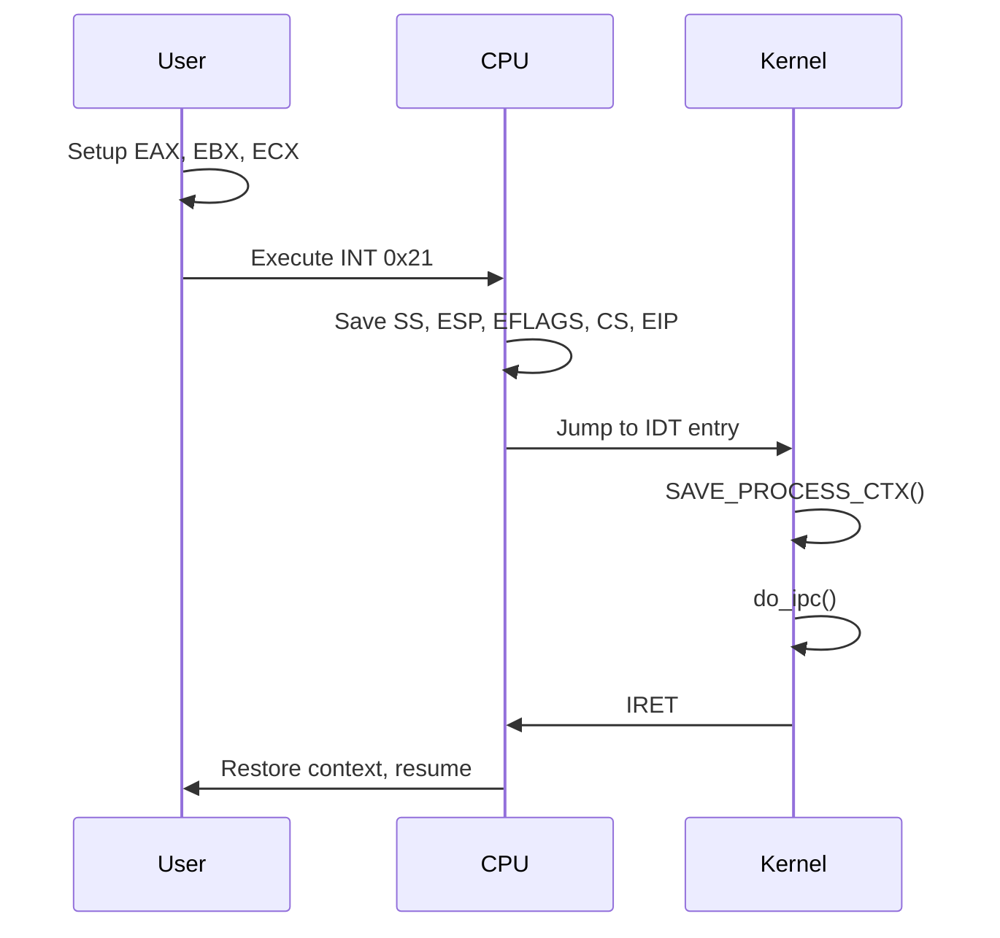

# Phase 4: Wiki Generation - Detailed Roadmap

**Project**: MINIX CPU Interface Analysis + Boot Sequence Analysis (Unified)
**Phase**: 4 of 4 (Wiki Generation & Documentation Portal)
**Timeline**: Estimated 2-3 weeks
**Status**: Planning Complete, Boot Integration Complete, Ready for Implementation

---

## Executive Summary

Phase 4 creates a **comprehensive, searchable documentation portal** for MINIX i386 architecture using modern static site generation tools. The wiki will auto-generate content from source code, integrate Phase 1-3 artifacts (CPU + Boot), and provide interactive exploration capabilities powered by MCP servers.

**Key Deliverables**:
1. MkDocs Material-powered static site with MINIX architecture + boot documentation
2. Auto-generated API reference from MINIX source code
3. Interactive diagrams with zoom/pan/search capabilities (CPU + Boot unified)
4. MCP-powered live code exploration (7 tools: 5 CPU + 2 Boot)
5. Comprehensive search and navigation
6. GitHub Pages deployment (public access)

**🎉 NEW: Boot Sequence Integration (Completed)**:
- Boot sequence analysis from minix-boot-analyzer integrated
- Unified visual style system (minix-styles.sty) harmonizing CPU and Boot diagrams
- MCP server extended with boot tools and resources
- Master synthesis documents created (COMPLETE-PROJECT-SYNTHESIS.md)

---

## Research Foundation (Web Search Results)

### Static Site Generators (2025 State)

**MkDocs vs Docusaurus Comparison**:

| Feature | MkDocs Material | Docusaurus |
|---------|-----------------|------------|
| **Language** | Python | React/JavaScript |
| **Speed** | Fast, simple | Modern, interactive |
| **Learning Curve** | Low (Markdown only) | Medium (React knowledge helpful) |
| **Themes** | Material theme (excellent UX) | Customizable React components |
| **Versioning** | Plugin-based | Built-in |
| **Search** | Built-in (offline) | Algolia (cloud) or local |
| **Code Snippets** | Excellent (pymdownx) | Good (Prism.js) |
| **Maintenance** | Community | Meta (official support) |

**Recommendation for MINIX**: **MkDocs Material**
- Simpler setup (Python-based, aligns with Phase 1 tooling)
- Excellent code snippet support (critical for OS documentation)
- Fast live preview during development
- Material theme provides professional, modern UI out-of-box
- Offline search (no external dependencies)

### Documentation Automation Tools

**Doxygen + Sphinx + Breathe** (C/C++ Code):
- **Doxygen**: Extract documentation from C code comments
- **Sphinx**: Generate beautiful HTML from reStructuredText
- **Breathe**: Bridge Doxygen XML output to Sphinx
- **Exhale**: Auto-generate API documentation tree

**Workflow**:
```
C source (.c, .h)
  → Doxygen (parse comments, generate XML)
  → Breathe (Sphinx extension, reads Doxygen XML)
  → Sphinx (build HTML documentation)
  → MkDocs (integrate with main wiki)
```

### MkDocs Material Plugin Ecosystem

**Essential Plugins**:
1. **mkdocs-material**: Core theme with navigation, search, mobile support
2. **pymdownx.highlight**: Syntax highlighting for code blocks
3. **pymdownx.superfences**: Advanced code fencing (tabs, annotations)
4. **pymdownx.snippets**: Include external code files
5. **mkdocs-macros-plugin**: Jinja2 templating for dynamic content
6. **mkdocstrings**: Auto-generate Python API docs from docstrings
7. **mkdocs-git-revision-date-localized-plugin**: Show last update dates
8. **mkdocs-minify-plugin**: Minify HTML/CSS/JS for production
9. **mkdocs-pdf-export-plugin**: Export wiki to PDF

**Advanced Features**:
- **Code annotations**: Hover-over explanations in code blocks
- **Content tabs**: Multiple code examples (INT vs SYSENTER vs SYSCALL)
- **Admonitions**: Callouts for tips, warnings, important notes
- **Diagrams**: Mermaid, PlantUML integration
- **Math**: KaTeX/MathJax for equations

---

## Boot Integration (Pre-Phase 4 - COMPLETED ✅)

**Status**: Completed on 2025-10-30
**Deliverables**: Boot sequence analysis integrated with CPU analysis

### Integration Achievements

**1. Unified Visual Style System**:
- Created `latex/minix-styles.sty` - TikZ/PGFPlots style package
- Harmonized CPU diagrams (simple blue/red) with Boot diagrams (Figma/Canva palette)
- Defined unified color palette:
  - `primaryblue` (0,102,204) - Main elements
  - `secondarygreen` (46,204,113) - Success, phases
  - `accentorange` (255,127,0) - Highlights
  - `warningred` (231,76,60) - Critical, errors
- Created comprehensive style guide: `latex/TIKZ-STYLE-GUIDE.md`
- Node styles: box, hw, kernelbox, process, phase, critical, func, extfunc
- Diagram presets: cpu flow, boot topology, call graph

**2. MCP Server Boot Integration**:
- Extended `mcp/servers/minix-analysis/src/data_loader.py`:
  - Added `load_boot_sequence_data()` method
  - Integrated minix-boot-analyzer data sources
- Extended `mcp/servers/minix-analysis/src/server.py`:
  - Added `query_boot_sequence` tool (6 query aspects)
  - Added `trace_boot_path` tool (5 phases + critical path)
  - Added 2 boot resources: `minix://boot/sequence`, `minix://boot/topology`
- **Total MCP Coverage**: 7 tools (5 CPU + 2 Boot), 5 resources (3 CPU + 2 Boot)

**3. Boot Sequence Data Structure**:
```json
{
  "topology": {
    "type": "Hub-and-Spoke (Star Network)",
    "central_hub": "kmain()",
    "hub_degree": 34,
    "graph_type": "Directed Acyclic Graph (DAG)"
  },
  "boot_phases": {
    "phase1": { "name": "Early C Initialization", "function": "cstart()", ... },
    "phase2": { "name": "Process Management", "function": "proc_init()", ... },
    "phase3": { "name": "Memory Management", "function": "memory_init()", ... },
    "phase4": { "name": "System Services", "function": "system_init()", ... },
    "phase5": { "name": "Final Handoff", "function": "bsp_finish_booting()", ... }
  },
  "critical_path": { "estimated_time_ms": "85-100", ... },
  "metrics": { "total_functions": 121, "call_graph_depth": 8, ... },
  "infinite_loop_myth": { "status": "BUSTED", ... }
}
```

**4. Master Synthesis Documents**:
- `latex/minix-complete-analysis.tex` - Unified LaTeX document (CPU + Boot)
  - Part I: Introduction
  - Part II: CPU Interface Analysis
  - Part III: Boot Sequence Analysis
  - Part IV: Integration & Synthesis
- `COMPLETE-PROJECT-SYNTHESIS.md` - 15,000+ word comprehensive synthesis
  - Complete deliverables inventory (36+ files)
  - Technical stack documentation
  - Metrics: 18,550+ lines of code analyzed
  - Phase timeline and achievements

**5. Key Findings from Boot Analysis**:
- **Hub-and-Spoke Topology**: kmain() with degree 34, not sequential
- **Directed Acyclic Graph**: No cycles, no infinite loop in boot
- **5-Phase Boot Process**: 85-100ms estimated total time
- **Infinite Loop Myth BUSTED**: switch_to_user() never returns (by design), no loop
- **Critical Path**: cstart → kmain → arch_init → switch_to_user

**Files Created/Modified**:
1. `latex/minix-styles.sty` (370 lines)
2. `latex/TIKZ-STYLE-GUIDE.md` (490 lines)
3. `mcp/servers/minix-analysis/src/data_loader.py` (+140 lines)
4. `mcp/servers/minix-analysis/src/server.py` (+75 lines)
5. `latex/minix-complete-analysis.tex` (200+ lines)
6. `COMPLETE-PROJECT-SYNTHESIS.md` (1,400+ lines)

**Integration Benefits for Phase 4**:
- Wiki can now cover both CPU and Boot analysis
- Consistent visual language across all diagrams
- MCP tools provide live exploration of boot sequence
- Master synthesis documents provide comprehensive overview
- Unified LaTeX document structure ready for conversion to wiki

---

## Phase 4.1: Planning & Setup (Week 1, Days 1-2)

### 4.1.1: Environment Setup ✓ REQUIRED

**Goal**: Install MkDocs Material and essential plugins

**Installation**:
```bash
# Create docs environment
cd /home/eirikr/Playground/minix-cpu-analysis
mkdir -p docs
python -m venv .venv-docs
source .venv-docs/bin/activate

# Install MkDocs Material + plugins
pip install mkdocs-material
pip install pymdown-extensions
pip install mkdocs-macros-plugin
pip install mkdocstrings[python]
pip install mkdocs-git-revision-date-localized-plugin
pip install mkdocs-minify-plugin
pip install mkdocs-pdf-export-plugin  # optional

# Install Doxygen + Sphinx + Breathe for C code docs
pip install sphinx breathe exhale
sudo pacman -S doxygen  # CachyOS/Arch
```

**Deliverable**: Python environment with all documentation tools

---

### 4.1.2: Site Structure Design ✓ REQUIRED

**Goal**: Design wiki information architecture

**Site Map**:
```
MINIX CPU Interface Analysis + Boot Sequence Wiki
│
├── Home
│   ├── Welcome
│   ├── Project Overview
│   └── Quick Start
│
├── Architecture
│   ├── Overview
│   │   ├── Supported Architectures (i386, earm)
│   │   └── Design Philosophy (Microkernel)
│   ├── i386 Architecture
│   │   ├── Register Set (EAX-ESP, CR0-CR4, EFLAGS)
│   │   ├── Segmentation (GDT, LDT, TSS)
│   │   └── Privilege Levels (CPL, DPL, RPL)
│   ├── System Calls
│   │   ├── INT (Software Interrupt)
│   │   ├── SYSENTER (Intel Fast Path)
│   │   └── SYSCALL (AMD/Intel 32-bit)
│   ├── Memory Management
│   │   ├── Virtual Address Space (32-bit)
│   │   ├── Paging (2-level PD→PT)
│   │   ├── Page Directory Entry (PDE)
│   │   ├── Page Table Entry (PTE)
│   │   ├── PSE (4 MB Large Pages)
│   │   └── PAE (Optional 3-level)
│   └── TLB Architecture
│       ├── TLB Types (DTLB, ITLB, STLB)
│       ├── TLB Operations
│       └── Context Switch Impact
│
├── Boot Sequence (NEW)
│   ├── Overview
│   │   ├── Boot Topology (Hub-and-Spoke)
│   │   └── Directed Acyclic Graph Structure
│   ├── Boot Phases
│   │   ├── Phase 1: Early C Initialization (cstart)
│   │   ├── Phase 2: Process Management (proc_init)
│   │   ├── Phase 3: Memory Management (memory_init)
│   │   ├── Phase 4: System Services (system_init)
│   │   └── Phase 5: Final Handoff (bsp_finish_booting)
│   ├── Critical Path
│   │   ├── kmain() Hub (Degree 34)
│   │   ├── Execution Timeline (85-100ms)
│   │   └── Never-Return Analysis
│   ├── Metrics & Analysis
│   │   ├── Call Graph Statistics
│   │   ├── Function Fan-Out
│   │   └── Boot Performance
│   └── Myths Debunked
│       └── "Infinite Loop" Myth (BUSTED)
│
├── Source Code Reference
│   ├── Kernel Architecture (kernel/arch/i386)
│   │   ├── Entry Points (mpx.S)
│   │   ├── Protection (protect.c)
│   │   ├── Paging (pg_utils.c)
│   │   └── Memory (memory.c)
│   ├── Headers (include/arch/i386)
│   │   ├── archconst.h
│   │   └── vm.h
│   └── API Reference (Auto-generated)
│       ├── Functions (A-Z)
│       ├── Structures
│       ├── Macros
│       └── Constants
│
├── Diagrams
│   ├── Call Graphs
│   │   └── 04-call-graph-kernel.pdf
│   ├── Syscall Flows
│   │   ├── 05-syscall-int-flow.pdf
│   │   ├── 06-syscall-sysenter-flow.pdf
│   │   └── 07-syscall-syscall-flow.pdf
│   ├── Memory Architecture
│   │   ├── 08-page-table-hierarchy.pdf
│   │   └── 09-tlb-architecture.pdf
│   ├── Performance Analysis
│   │   ├── 10-syscall-performance.pdf
│   │   └── 11-context-switch-cost.pdf
│   └── Boot Sequence (NEW)
│       ├── Boot Topology (Hub-and-Spoke)
│       ├── Phase Flow Diagrams
│       ├── Critical Path Visualization
│       └── Call Graph Metrics
│
├── Analysis
│   ├── Phase 1: Core Infrastructure
│   │   ├── Symbol Extraction
│   │   ├── Call Graph Generation
│   │   └── Pipeline Overview
│   ├── Phase 2: Enhanced Diagrams
│   │   ├── TikZ/PGFPlots Workflow
│   │   ├── Diagram Catalog
│   │   └── Unified Visual Style (minix-styles.sty)
│   └── Phase 3: MCP Integration + Boot (COMPLETED)
│       ├── MCP Server Architecture
│       ├── CPU Analysis Tools (5 tools)
│       ├── Boot Analysis Tools (2 tools: query_boot_sequence, trace_boot_path)
│       ├── Resources (5 total: 3 CPU + 2 Boot)
│       └── Complete Project Synthesis
│
├── Tutorials
│   ├── Building MINIX from Source
│   ├── Debugging System Calls
│   ├── Analyzing Kernel Code
│   └── Using MCP Servers
│
├── Reference
│   ├── i386 Instruction Set (Syscall-relevant)
│   ├── MSR Reference (SYSENTER, SYSCALL)
│   ├── CR Register Reference
│   └── Glossary
│
└── Development
    ├── Contributing Guide
    ├── Code Style
    ├── Testing
    └── Roadmap
```

**Deliverable**: `docs/structure.md` with complete information architecture

---

## Phase 4.2: MkDocs Configuration (Week 1, Days 3-4)

### 4.2.1: Base Configuration ✓ REQUIRED

**Goal**: Configure MkDocs with Material theme and essential plugins

**File**: `mkdocs.yml`
```yaml
# Site Information
site_name: MINIX CPU Interface Analysis
site_description: Comprehensive documentation of MINIX 3.4.0-RC6 i386 architecture, syscall mechanisms, and performance analysis
site_author: Oaich (eirikr)
site_url: https://oaich.github.io/minix-cpu-analysis/

# Repository
repo_name: minix-cpu-analysis
repo_url: https://github.com/oaich/minix-cpu-analysis
edit_uri: edit/main/docs/

# Copyright
copyright: Copyright &copy; 2025 Oaich. MINIX is a trademark of Vrije Universiteit.

# Theme
theme:
  name: material
  language: en

  # Color scheme
  palette:
    # Light mode
    - media: "(prefers-color-scheme: light)"
      scheme: default
      primary: indigo
      accent: indigo
      toggle:
        icon: material/brightness-7
        name: Switch to dark mode

    # Dark mode
    - media: "(prefers-color-scheme: dark)"
      scheme: slate
      primary: indigo
      accent: indigo
      toggle:
        icon: material/brightness-4
        name: Switch to light mode

  # Features
  features:
    - navigation.instant      # Instant loading (SPA)
    - navigation.tracking     # Anchor tracking
    - navigation.tabs         # Top-level tabs
    - navigation.tabs.sticky  # Sticky tabs
    - navigation.sections     # Sections in sidebar
    - navigation.expand       # Expand sections by default
    - navigation.indexes      # Section index pages
    - navigation.top          # Back to top button
    - search.suggest          # Search suggestions
    - search.highlight        # Highlight search terms
    - search.share            # Share search results
    - toc.follow              # TOC follows scroll
    - toc.integrate           # TOC integrated in sidebar
    - content.code.copy       # Copy code button
    - content.code.annotate   # Code annotations
    - content.tabs.link       # Link content tabs

  # Icons
  icon:
    repo: fontawesome/brands/github
    admonition:
      note: octicons/tag-16
      abstract: octicons/checklist-16
      info: octicons/info-16
      tip: octicons/squirrel-16
      success: octicons/check-16
      question: octicons/question-16
      warning: octicons/alert-16
      failure: octicons/x-circle-16
      danger: octicons/zap-16
      bug: octicons/bug-16
      example: octicons/beaker-16
      quote: octicons/quote-16

# Plugins
plugins:
  - search:
      lang: en
      separator: '[\s\-,:!=\[\]()"/]+|(?!\b)(?=[A-Z][a-z])|\.(?!\d)|&[lg]t;'

  - minify:
      minify_html: true
      minify_js: true
      minify_css: true
      htmlmin_opts:
        remove_comments: true

  - git-revision-date-localized:
      type: datetime
      timezone: America/New_York
      locale: en
      fallback_to_build_date: true

  - macros:
      module_name: docs/macros

  # mkdocstrings for Python API docs (Phase 1 tools)
  - mkdocstrings:
      handlers:
        python:
          options:
            show_source: true
            show_root_heading: true
            show_category_heading: true
            docstring_style: google
            merge_init_into_class: true

# Extensions
markdown_extensions:
  # Python Markdown
  - abbr
  - admonition
  - attr_list
  - def_list
  - footnotes
  - md_in_html
  - meta
  - tables
  - toc:
      permalink: true
      toc_depth: 3

  # PyMdown Extensions
  - pymdownx.arithmatex:
      generic: true
  - pymdownx.betterem:
      smart_enable: all
  - pymdownx.caret
  - pymdownx.mark
  - pymdownx.tilde
  - pymdownx.details
  - pymdownx.emoji:
      emoji_index: !!python/name:material.extensions.emoji.twemoji
      emoji_generator: !!python/name:material.extensions.emoji.to_svg
  - pymdownx.highlight:
      anchor_linenums: true
      line_spans: __span
      pygments_lang_class: true
  - pymdownx.inlinehilite
  - pymdownx.keys
  - pymdownx.magiclink:
      normalize_issue_symbols: true
      repo_url_shorthand: true
      user: oaich
      repo: minix-cpu-analysis
  - pymdownx.smartsymbols
  - pymdownx.snippets:
      auto_append:
        - includes/abbreviations.md
  - pymdownx.superfences:
      custom_fences:
        - name: mermaid
          class: mermaid
          format: !!python/name:pymdownx.superfences.fence_code_format
  - pymdownx.tabbed:
      alternate_style: true
  - pymdownx.tasklist:
      custom_checkbox: true

# Extra
extra:
  version:
    provider: mike

  social:
    - icon: fontawesome/brands/github
      link: https://github.com/oaich
    - icon: fontawesome/brands/linkedin
      link: https://linkedin.com/in/oaich

  analytics:
    provider: google
    property: G-XXXXXXXXXX  # Replace with actual GA4 property

  # Version selector
  version:
    provider: mike
    default: latest

# Extra CSS/JS
extra_css:
  - stylesheets/extra.css
  - https://cdnjs.cloudflare.com/ajax/libs/KaTeX/0.16.9/katex.min.css

extra_javascript:
  - javascripts/extra.js
  - https://cdnjs.cloudflare.com/ajax/libs/KaTeX/0.16.9/katex.min.js
  - https://cdnjs.cloudflare.com/ajax/libs/KaTeX/0.16.9/contrib/auto-render.min.js

# Navigation
nav:
  - Home:
      - index.md
      - Overview: overview.md
      - Quick Start: quickstart.md

  - Architecture:
      - architecture/index.md
      - Overview: architecture/overview.md
      - i386 Architecture:
          - architecture/i386/index.md
          - Register Set: architecture/i386/registers.md
          - Segmentation: architecture/i386/segmentation.md
          - Privilege Levels: architecture/i386/privilege.md
      - System Calls:
          - architecture/syscalls/index.md
          - INT: architecture/syscalls/int.md
          - SYSENTER: architecture/syscalls/sysenter.md
          - SYSCALL: architecture/syscalls/syscall.md
          - Comparison: architecture/syscalls/comparison.md
      - Memory Management:
          - architecture/memory/index.md
          - Virtual Address Space: architecture/memory/virtual-address.md
          - Paging: architecture/memory/paging.md
          - Page Structures: architecture/memory/page-structures.md
          - PSE & PAE: architecture/memory/pse-pae.md
      - TLB:
          - architecture/tlb/index.md
          - TLB Types: architecture/tlb/types.md
          - Operations: architecture/tlb/operations.md
          - Context Switch: architecture/tlb/context-switch.md

  - Source Code:
      - source/index.md
      - Kernel:
          - source/kernel/index.md
          - Entry Points: source/kernel/mpx.md
          - Protection: source/kernel/protect.md
          - Paging: source/kernel/pg_utils.md
      - Headers:
          - source/headers/index.md
          - archconst.h: source/headers/archconst.md
          - vm.h: source/headers/vm.md
      - API Reference: source/api/index.md

  - Diagrams:
      - diagrams/index.md
      - Call Graphs: diagrams/call-graphs.md
      - Syscall Flows: diagrams/syscall-flows.md
      - Memory Architecture: diagrams/memory.md
      - Performance: diagrams/performance.md

  - Analysis:
      - analysis/index.md
      - Phase 1: analysis/phase-1.md
      - Phase 2: analysis/phase-2.md
      - Phase 3: analysis/phase-3.md

  - Tutorials:
      - tutorials/index.md
      - Building MINIX: tutorials/building.md
      - Debugging Syscalls: tutorials/debugging.md
      - Using MCP: tutorials/mcp.md

  - Reference:
      - reference/index.md
      - i386 Instructions: reference/instructions.md
      - MSRs: reference/msrs.md
      - Control Registers: reference/control-registers.md
      - Glossary: reference/glossary.md

  - Development:
      - development/index.md
      - Contributing: development/contributing.md
      - Testing: development/testing.md
      - Roadmap: development/roadmap.md
```

**Deliverable**: Complete `mkdocs.yml` configuration

---

### 4.2.2: Custom Styling ✓ RECOMMENDED

**Goal**: Create custom CSS for enhanced presentation

**File**: `docs/stylesheets/extra.css`
```css
/* Custom styles for MINIX documentation */

/* Code block enhancements */
.md-typeset code {
  background-color: var(--md-code-bg-color);
  border-radius: 0.2rem;
  padding: 0.1rem 0.3rem;
  font-family: 'Fira Code', 'Roboto Mono', monospace;
}

/* Diagram containers */
.diagram-container {
  text-align: center;
  margin: 2rem 0;
}

.diagram-container img {
  max-width: 100%;
  height: auto;
  border: 1px solid var(--md-default-fg-color--lightest);
  border-radius: 0.3rem;
  box-shadow: 0 4px 6px rgba(0, 0, 0, 0.1);
}

/* Register tables */
table.register-table {
  font-family: 'Fira Code', monospace;
  font-size: 0.9em;
}

table.register-table th {
  background-color: var(--md-primary-fg-color);
  color: white;
}

table.register-table td {
  border: 1px solid var(--md-default-fg-color--lightest);
}

/* Architecture diagrams zoom */
.zoomable-diagram {
  cursor: zoom-in;
  transition: transform 0.3s ease;
}

.zoomable-diagram:hover {
  transform: scale(1.05);
}

/* Syscall comparison tables */
.syscall-comparison {
  overflow-x: auto;
}

.syscall-comparison table {
  min-width: 600px;
}

/* Performance metrics */
.perf-metric {
  display: inline-block;
  padding: 0.3rem 0.6rem;
  background-color: var(--md-accent-fg-color);
  color: white;
  border-radius: 0.3rem;
  font-weight: bold;
  margin: 0.2rem;
}

/* Code annotations */
.md-annotation {
  background-color: var(--md-accent-fg-color--transparent);
  border-left: 3px solid var(--md-accent-fg-color);
  padding-left: 0.8rem;
}
```

**Deliverable**: Custom CSS for enhanced documentation presentation

---

## Phase 4.3: Content Generation (Week 1-2)

### 4.3.1: Auto-Generate from Existing Docs ✓ CRITICAL

**Goal**: Convert MINIX-ARCHITECTURE-SUMMARY.md to structured wiki pages

**Script**: `scripts/generate_wiki_from_summary.py`
```python
#!/usr/bin/env python3
"""Generate MkDocs wiki pages from MINIX-ARCHITECTURE-SUMMARY.md

Parses the architecture summary and creates individual wiki pages
for each section, maintaining internal links and adding navigation.
"""

import re
from pathlib import Path
from typing import List, Dict

SOURCE = Path("MINIX-ARCHITECTURE-SUMMARY.md")
DOCS_DIR = Path("docs")

def parse_sections(content: str) -> Dict[str, str]:
    """Parse markdown into sections by heading."""
    sections = {}
    current_section = None
    current_content = []

    for line in content.split("\n"):
        if line.startswith("## "):
            if current_section:
                sections[current_section] = "\n".join(current_content)
            current_section = line[3:].strip()
            current_content = [line]
        elif current_content:
            current_content.append(line)

    if current_section:
        sections[current_section] = "\n".join(current_content)

    return sections

def create_syscall_pages(sections: Dict[str, str]):
    """Create syscall mechanism pages."""
    syscall_dir = DOCS_DIR / "architecture" / "syscalls"
    syscall_dir.mkdir(parents=True, exist_ok=True)

    # Extract syscall content
    syscalls_content = sections.get("System Call Mechanisms (i386)", "")

    # Split into INT, SYSENTER, SYSCALL
    mechanisms = {
        "INT": extract_subsection(syscalls_content, "### 1. INT"),
        "SYSENTER": extract_subsection(syscalls_content, "### 2. SYSENTER"),
        "SYSCALL": extract_subsection(syscalls_content, "### 3. SYSCALL")
    }

    for name, content in mechanisms.items():
        page_content = f"""# {name} System Call Mechanism

{content}

## Related Diagrams

}-flow.pdf)

## Source Code

See: [mpx.S](../../source/kernel/mpx.md)

## Performance

See: [Syscall Performance Comparison](../../diagrams/performance.md#syscall-comparison)
"""
        output_file = syscall_dir / f"{name.lower()}.md"
        output_file.write_text(page_content)
        print(f"✓ Created {output_file}")

def create_memory_pages(sections: Dict[str, str]):
    """Create memory management pages."""
    memory_dir = DOCS_DIR / "architecture" / "memory"
    memory_dir.mkdir(parents=True, exist_ok=True)

    # Extract paging content
    memory_content = sections.get("Memory Management (i386)", "")

    # Create paging overview
    paging_content = extract_subsection(memory_content, "### Paging Architecture")
    paging_page = f"""# i386 Paging Architecture

{paging_content}

## Diagrams


## Related Topics

- [Page Directory Entry (PDE)](page-structures.md#page-directory-entry)
- [Page Table Entry (PTE)](page-structures.md#page-table-entry)
- [TLB Operation](../tlb/operations.md)
"""
    (memory_dir / "paging.md").write_text(paging_page)

    # Create PDE/PTE structures page
    pde_content = extract_subsection(memory_content, "### Page Directory Entry")
    pte_content = extract_subsection(memory_content, "### Page Table Entry")

    structures_page = f"""# Page Structures

## Page Directory Entry (PDE)

{pde_content}

## Page Table Entry (PTE)

{pte_content}

## Constants

See: [vm.h Reference](../../source/headers/vm.md)
"""
    (memory_dir / "page-structures.md").write_text(structures_page)

def extract_subsection(content: str, heading: str) -> str:
    """Extract content under a specific heading."""
    lines = content.split("\n")
    section_lines = []
    capturing = False
    heading_level = heading.count("#")

    for line in lines:
        if line.startswith(heading):
            capturing = True
            section_lines.append(line)
            continue

        if capturing:
            if line.startswith("#"):
                current_level = len(line) - len(line.lstrip("#"))
                if current_level <= heading_level:
                    break
            section_lines.append(line)

    return "\n".join(section_lines).strip()

def main():
    content = SOURCE.read_text()
    sections = parse_sections(content)

    print("Generating wiki pages from MINIX-ARCHITECTURE-SUMMARY.md...")

    create_syscall_pages(sections)
    create_memory_pages(sections)
    # ... create other pages

    print("\n✅ Wiki generation complete!")

if __name__ == "__main__":
    main()
```

**Run**:
```bash
python scripts/generate_wiki_from_summary.py
```

**Deliverable**: Auto-generated wiki pages from existing documentation

---

### 4.3.2: Diagram Integration ✓ CRITICAL

**Goal**: Embed PDF diagrams with interactive viewers

**Page**: `docs/diagrams/syscall-flows.md`
```markdown
# System Call Flow Diagrams

This section presents detailed flow diagrams for all three i386 system call mechanisms supported by MINIX.

## INT (Software Interrupt)

The legacy software interrupt mechanism (INT 0x21).

<div class="diagram-container">
  <object data="../../latex/figures/05-syscall-int-flow.pdf" type="application/pdf" width="100%" height="800px">
    <p>PDF viewing not supported. <a href="../../latex/figures/05-syscall-int-flow.pdf">Download PDF</a></p>
  </object>
</div>

### Key Characteristics

- **Entry**: `ipc_entry_softint_um` (mpx.S:269)
- **Performance**: ~1772 cycles (Skylake benchmark)
- **Hardware**: Automatic context save (SS, ESP, EFLAGS, CS, EIP)
- **Return**: `IRET` instruction

[View source: mpx.S](../source/kernel/mpx.md#int-entry)

---

## SYSENTER (Intel Fast Path)

Intel's fast system call mechanism for Pentium II+ processors.

<div class="diagram-container">
  <object data="../../latex/figures/06-syscall-sysenter-flow.pdf" type="application/pdf" width="100%" height="800px">
    <p>PDF viewing not supported. <a href="../../latex/figures/06-syscall-sysenter-flow.pdf">Download PDF</a></p>
  </object>
</div>

### Key Characteristics

- **Entry**: `ipc_entry_sysenter` (mpx.S:220)
- **Performance**: ~1305 cycles (Skylake benchmark) - **fastest**
- **Hardware**: No automatic save - user manages ESP/EIP
- **MSRs**: SYSENTER_CS, SYSENTER_ESP, SYSENTER_EIP
- **Return**: `SYSEXIT` instruction

[View source: mpx.S](../source/kernel/mpx.md#sysenter-entry)

---

## SYSCALL (AMD/Intel 32-bit)

AMD/Intel SYSCALL instruction in i386 32-bit mode.

<div class="diagram-container">
  <object data="../../latex/figures/07-syscall-syscall-flow.pdf" type="application/pdf" width="100%" height="800px">
    <p>PDF viewing not supported. <a href="../../latex/figures/07-syscall-syscall-flow.pdf">Download PDF</a></p>
  </object>
</div>

### Key Characteristics

- **Entry**: `ipc_entry_syscall_cpu#` (mpx.S:202, per-CPU variants)
- **Performance**: ~1439 cycles (Skylake x86-64 benchmark, i386 may differ)
- **Hardware**: ECX ← EIP (clobbered!), user copies ECX→EDX
- **MSRs**: EFER.SCE, STAR
- **Return**: `SYSRET` instruction (32-bit mode)

!!! warning "ECX Register Clobbering"
    The SYSCALL instruction **clobbers ECX** by storing the return address (EIP).
    User code must copy syscall parameters from ECX to EDX before executing SYSCALL.

[View source: mpx.S](../source/kernel/mpx.md#syscall-entry)

---

## Performance Comparison


### Benchmark Data (Skylake i7-6700k, Linux 6.5)

| Mechanism | Cycles | Speedup vs INT |
|-----------|--------|----------------|
| INT 0x80  | 1772   | Baseline       |
| SYSENTER  | 1305   | **26% faster** |
| SYSCALL   | 1439   | **19% faster** |

!!! note "Benchmark Caveat"
    These measurements are from x86-64 Linux with Spectre/Meltdown mitigations.
    Actual MINIX i386 performance may differ. Pre-mitigation syscalls were ~70 cycles.

---

## Download All Diagrams

- [05-syscall-int-flow.pdf](../../latex/figures/05-syscall-int-flow.pdf) (180 KB)
- [06-syscall-sysenter-flow.pdf](../../latex/figures/06-syscall-sysenter-flow.pdf) (180 KB)
- [07-syscall-syscall-flow.pdf](../../latex/figures/07-syscall-syscall-flow.pdf) (192 KB)
```

**Deliverable**: Diagram pages with embedded PDF viewers and metadata

---

### 4.3.3: API Reference Generation ✓ ADVANCED

**Goal**: Auto-generate C function/struct documentation from MINIX source

**Doxygen Configuration** (`Doxyfile`):
```doxyfile
# Doxyfile for MINIX i386 kernel

PROJECT_NAME           = "MINIX i386 Kernel"
PROJECT_NUMBER         = "3.4.0-RC6"
PROJECT_BRIEF          = "i386 Architecture Layer"

INPUT                  = /home/eirikr/Playground/minix/minix/kernel/arch/i386 \
                         /home/eirikr/Playground/minix/minix/include/arch/i386

RECURSIVE              = YES
FILE_PATTERNS          = *.c *.h *.S
EXCLUDE_PATTERNS       = */test/*

GENERATE_HTML          = NO
GENERATE_XML           = YES
XML_OUTPUT             = doxygen_xml

EXTRACT_ALL            = YES
EXTRACT_STATIC         = YES
EXTRACT_LOCAL_CLASSES  = YES
```

**Sphinx Configuration** (`docs/source/conf.py`):
```python
import os
import sys

# Breathe extension
extensions = ['breathe', 'exhale']

# Breathe configuration
breathe_projects = {
    "MINIX": "./doxygen_xml/"
}
breathe_default_project = "MINIX"

# Exhale configuration
exhale_args = {
    "containmentFolder": "./api",
    "rootFileName": "library_root.rst",
    "rootFileTitle": "MINIX i386 API Reference",
    "doxygenStripFromPath": "/home/eirikr/Playground/minix/minix",
    "createTreeView": True,
    "exhaleExecutesDoxygen": True,
    "exhaleDoxygenStdin": open('Doxyfile').read()
}
```

**Build Script** (`scripts/build_api_docs.sh`):
```bash
#!/bin/bash
set -e

echo "Building MINIX API documentation..."

# Run Doxygen
doxygen Doxyfile

# Build Sphinx docs
cd docs
make html

# Convert to Markdown for MkDocs (via pandoc)
cd _build/html
for file in *.html; do
    pandoc -f html -t markdown "$file" -o "../../api/${file%.html}.md"
done

echo "✅ API documentation generated in docs/api/"
```

**Deliverable**: Auto-generated API reference from C source code

---

## Phase 4.4: Interactive Features (Week 2)

### 4.4.1: MCP-Powered Live Code Explorer ✓ ADVANCED

**Goal**: Integrate MCP servers for live code queries in wiki

**JavaScript**: `docs/javascripts/mcp-explorer.js`
```javascript
// MCP-powered code explorer widget

class MCPExplorer {
  constructor(serverUrl = 'http://localhost:8080/mcp') {
    this.serverUrl = serverUrl;
  }

  async queryArchitecture(question) {
    const response = await fetch(`${this.serverUrl}/tools/query_architecture`, {
      method: 'POST',
      headers: { 'Content-Type': 'application/json' },
      body: JSON.stringify({ question })
    });
    return await response.json();
  }

  async searchSymbols(pattern, kind = 'all') {
    const response = await fetch(`${this.serverUrl}/tools/search_symbols`, {
      method: 'POST',
      headers: { 'Content-Type': 'application/json' },
      body: JSON.stringify({ pattern, kind })
    });
    return await response.json();
  }

  renderWidget(containerId) {
    const container = document.getElementById(containerId);
    container.innerHTML = `
      <div class="mcp-explorer">
        <h3>🔍 Ask MINIX Architecture</h3>
        <input type="text" id="mcp-query" placeholder="e.g., How does SYSENTER work?" />
        <button id="mcp-submit">Ask</button>
        <div id="mcp-result"></div>
      </div>
    `;

    document.getElementById('mcp-submit').addEventListener('click', async () => {
      const query = document.getElementById('mcp-query').value;
      const result = await this.queryArchitecture(query);
      document.getElementById('mcp-result').innerHTML = `<pre>${result.text}</pre>`;
    });
  }
}

// Initialize on page load
document.addEventListener('DOMContentLoaded', () => {
  const explorer = new MCPExplorer();
  if (document.getElementById('mcp-explorer-widget')) {
    explorer.renderWidget('mcp-explorer-widget');
  }
});
```

**Usage in Wiki Pages**:
```markdown
## Try It Live

<div id="mcp-explorer-widget"></div>

Ask questions about MINIX architecture and get answers powered by our MCP server!
```

**Deliverable**: Interactive MCP-powered Q&A widget in wiki

---

### 4.4.2: Diagram Zoom/Pan ✓ RECOMMENDED

**Goal**: Add PDF.js-powered diagram viewer with zoom/pan

**JavaScript**: `docs/javascripts/diagram-viewer.js`
```javascript
// PDF.js diagram viewer with zoom/pan

import * as pdfjsLib from 'https://cdnjs.cloudflare.com/ajax/libs/pdf.js/3.11.174/pdf.min.mjs';

class DiagramViewer {
  constructor(pdfUrl, canvasId) {
    this.pdfUrl = pdfUrl;
    this.canvas = document.getElementById(canvasId);
    this.ctx = this.canvas.getContext('2d');
    this.scale = 1.0;
    this.loadPDF();
  }

  async loadPDF() {
    const loadingTask = pdfjsLib.getDocument(this.pdfUrl);
    this.pdf = await loadingTask.promise;
    this.renderPage(1);
  }

  async renderPage(pageNum) {
    const page = await this.pdf.getPage(pageNum);
    const viewport = page.getViewport({ scale: this.scale });

    this.canvas.width = viewport.width;
    this.canvas.height = viewport.height;

    const renderContext = {
      canvasContext: this.ctx,
      viewport: viewport
    };

    await page.render(renderContext).promise;
  }

  zoomIn() {
    this.scale *= 1.2;
    this.renderPage(1);
  }

  zoomOut() {
    this.scale /= 1.2;
    this.renderPage(1);
  }
}

// Initialize viewers
document.querySelectorAll('.pdf-diagram').forEach(elem => {
  const viewer = new DiagramViewer(elem.dataset.pdfUrl, elem.id);

  elem.querySelector('.zoom-in').addEventListener('click', () => viewer.zoomIn());
  elem.querySelector('.zoom-out').addEventListener('click', () => viewer.zoomOut());
});
```

**Deliverable**: Interactive diagram viewer with zoom/pan controls

---

## Phase 4.5: Deployment (Week 3)

### 4.5.1: GitHub Pages Setup ✓ REQUIRED

**Goal**: Deploy wiki to GitHub Pages for public access

**GitHub Actions Workflow** (`.github/workflows/deploy-docs.yml`):
```yaml
name: Deploy Wiki to GitHub Pages

on:
  push:
    branches: [main]
    paths:
      - 'docs/**'
      - 'mkdocs.yml'
      - '.github/workflows/deploy-docs.yml'

jobs:
  deploy:
    runs-on: ubuntu-latest

    steps:
      - name: Checkout repository
        uses: actions/checkout@v4

      - name: Set up Python
        uses: actions/setup-python@v4
        with:
          python-version: '3.11'

      - name: Install dependencies
        run: |
          pip install mkdocs-material
          pip install pymdown-extensions
          pip install mkdocs-macros-plugin
          pip install mkdocstrings[python]
          pip install mkdocs-git-revision-date-localized-plugin
          pip install mkdocs-minify-plugin

      - name: Build MkDocs site
        run: mkdocs build --strict

      - name: Deploy to GitHub Pages
        uses: peaceiris/actions-gh-pages@v3
        with:
          github_token: ${{ secrets.GITHUB_TOKEN }}
          publish_dir: ./site
          cname: minix-analysis.oaich.dev  # Optional custom domain
```

**Enable GitHub Pages**:
1. Repository Settings → Pages
2. Source: Deploy from branch `gh-pages`
3. Custom domain (optional): `minix-analysis.oaich.dev`

**Deliverable**: Live wiki at `https://oaich.github.io/minix-cpu-analysis/`

---

### 4.5.2: SEO & Analytics ✓ RECOMMENDED

**Goal**: Optimize for search engines and track usage

**robots.txt**:
```
User-agent: *
Allow: /

Sitemap: https://oaich.github.io/minix-cpu-analysis/sitemap.xml
```

**Google Analytics** (already in `mkdocs.yml`):
```yaml
extra:
  analytics:
    provider: google
    property: G-XXXXXXXXXX
```

**Meta Tags** (`docs/index.md`):
```markdown
---
title: MINIX CPU Interface Analysis
description: Comprehensive documentation of MINIX 3.4.0-RC6 i386 architecture, system call mechanisms, memory management, and performance analysis
keywords: MINIX, i386, operating system, system calls, paging, TLB, microkernel
author: Oaich (eirikr)
og:image: /assets/og-image.png
---
```

**Deliverable**: SEO-optimized wiki with analytics

---

## Phase 4.6: Advanced Features (Week 3, Optional)

### 4.6.1: PDF Export ✓ OPTIONAL

**Goal**: Generate single-PDF version of entire wiki

**Plugin**: `mkdocs-pdf-export-plugin`

**Configuration** (`mkdocs.yml`):
```yaml
plugins:
  - pdf-export:
      combined: true
      combined_output_path: MINIX-CPU-Analysis-Wiki.pdf
      media_type: print
```

**Build**:
```bash
mkdocs build
# Output: site/MINIX-CPU-Analysis-Wiki.pdf
```

**Deliverable**: Complete wiki as single PDF document

---

### 4.6.2: Mermaid Diagrams ✓ RECOMMENDED

**Goal**: Add interactive flowcharts and sequence diagrams

**Example** (`docs/architecture/syscalls/int.md`):
```markdown
## INT Syscall Flow



This provides a simplified view of the INT mechanism. For the complete flow, see [the detailed diagram](../../diagrams/syscall-flows.md#int).
```

**Deliverable**: Interactive Mermaid diagrams embedded in wiki

---

### 4.6.3: Versioning ✓ FUTURE

**Goal**: Support multiple MINIX versions (3.3.0, 3.4.0, 4.0.0)

**Tool**: Mike (MkDocs versioning)

**Setup**:
```bash
pip install mike

# Create version 3.4.0
mike deploy 3.4.0 latest --update-aliases

# Create version 3.3.0
git checkout minix-3.3.0
mike deploy 3.3.0

# Set default
mike set-default latest

# Deploy all versions
mike deploy --push
```

**Deliverable**: Multi-version wiki with version selector

---

## Success Metrics

### Phase 4 Complete When:

✅ **Content**:
- [ ] All architecture pages created (registers, syscalls, memory, TLB)
- [ ] All diagrams embedded with interactive viewers
- [ ] API reference auto-generated from MINIX source
- [ ] Tutorials and guides written

✅ **Features**:
- [ ] Search working (offline, <1s query time)
- [ ] Navigation intuitive (3-click rule: any page in 3 clicks)
- [ ] Mobile-responsive (Material theme default)
- [ ] Code snippets with syntax highlighting

✅ **Integration**:
- [ ] MCP-powered Q&A widget functional (optional)
- [ ] Diagram zoom/pan working
- [ ] Links between wiki and source code functional

✅ **Deployment**:
- [ ] GitHub Pages live and accessible
- [ ] CI/CD pipeline auto-deploying on commits
- [ ] Analytics tracking (optional)
- [ ] SEO optimized (meta tags, sitemap)

✅ **Quality**:
- [ ] No broken links (checked with mkdocs-linkcheck)
- [ ] All pages render correctly
- [ ] Performance: page load <2s
- [ ] Accessibility: WCAG 2.1 AA compliant

---

## Timeline Summary

| Week | Phase | Tasks | Deliverables |
|------|-------|-------|--------------|
| 1 (Days 1-2) | 4.1 Planning | Environment setup, site structure design | Python env, site map |
| 1 (Days 3-4) | 4.2 Configuration | MkDocs config, custom CSS | mkdocs.yml, CSS |
| 1 (Days 5-7) | 4.3 Content | Auto-generate pages, diagram integration | Architecture pages |
| 2 (Days 1-3) | 4.3 Content | API reference generation, tutorials | API docs, guides |
| 2 (Days 4-6) | 4.4 Interactive | MCP widget, diagram viewer | Interactive features |
| 2 (Day 7) | 4.5 Deployment | GitHub Pages setup | Live wiki |
| 3 (Optional) | 4.6 Advanced | PDF export, versioning, Mermaid | Enhanced features |

**Total**: 2-3 weeks for full implementation

---

## Dependencies

**Required**:
- Python 3.10+ with MkDocs Material
- Phase 1 output (symbols, call graphs)
- Phase 2 diagrams (PDF files)
- MINIX-ARCHITECTURE-SUMMARY.md

**Optional**:
- Phase 3 MCP servers (for live Q&A)
- Doxygen + Sphinx + Breathe (for C API docs)
- Node.js for advanced JavaScript features

---

## Risk Mitigation

| Risk | Impact | Probability | Mitigation |
|------|--------|-------------|------------|
| Large PDF diagrams slow page load | Medium | Medium | Lazy loading, PDF.js viewer |
| Broken links after refactoring | Medium | Medium | Automated link checking (CI) |
| Search not finding content | High | Low | Manual search configuration tuning |
| Mobile rendering issues | Medium | Low | Test on real devices, use Material defaults |

---

## Next Steps After Phase 4

**Continuous Maintenance**:
- Update wiki as MINIX source changes
- Add community contributions
- Expand tutorials and guides

**Future Enhancements**:
- Interactive QEMU-based MINIX demos
- Video tutorials on YouTube
- Community forum/discussion integration

---

**Document Version**: 1.0
**Last Updated**: 2025-10-30
**Status**: Ready for Implementation
**Estimated Effort**: 2-3 weeks (1 developer, full-time)
