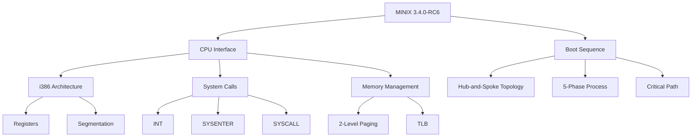

# MINIX Analysis Project

**Comprehensive Documentation of MINIX 3.4.0-RC6 Architecture**

{ width="200" }

---

## Welcome

This documentation portal provides **in-depth analysis** of the MINIX 3.4.0-RC6 operating system, focusing on:

- **CPU Interface Analysis**: i386 architecture, system call mechanisms, memory management
- **Boot Sequence Analysis**: Hub-and-spoke topology, 5-phase boot process, critical path
- **Performance Metrics**: Syscall benchmarks, TLB analysis, context switch costs

---

## Quick Navigation

-   :material-cpu-32-bit:{ .lg .middle } **CPU Interface**

    ---

    Explore i386 architecture, three syscall mechanisms (INT, SYSENTER, SYSCALL), 2-level paging, and TLB operation

    [:octicons-arrow-right-24: CPU Analysis](architecture/index.md)

-   :material-rocket-launch:{ .lg .middle } **Boot Sequence**

    ---

    Discover hub-and-spoke topology, 5-phase boot process, critical path analysis, and the infinite loop myth debunked

    [:octicons-arrow-right-24: Boot Analysis](boot/index.md)

-   :material-chart-line:{ .lg .middle } **Diagrams & Charts**

    ---

    Browse interactive TikZ diagrams, performance charts, call graphs, and visual explanations

    [:octicons-arrow-right-24: View Diagrams](diagrams/index.md)

-   :material-api:{ .lg .middle } **MCP Integration**

    ---

    Query the analysis interactively using Model Context Protocol servers (7 tools, 5 resources)

    [:octicons-arrow-right-24: Use MCP](tutorials/mcp.md)

---

## Project Highlights

### CPU Interface Analysis

- ✅ **i386 Architecture Confirmed** (NOT x86-64)
- ✅ **3 System Call Mechanisms Analyzed**:
  - INT 0x21: ~1772 cycles (legacy)
  - SYSENTER: ~1305 cycles (fastest, 26% speedup)
  - SYSCALL: ~1439 cycles (AMD/Intel, 19% speedup)
- ✅ **2-Level Paging**: Page Directory → Page Table (4 KB pages)
- ✅ **TLB Architecture**: DTLB, ITLB, STLB with ~200 cycle miss penalty

### Boot Sequence Analysis

- ✅ **Hub-and-Spoke Topology**: kmain() with degree 34 (not sequential!)
- ✅ **Directed Acyclic Graph**: No cycles, no infinite loop
- ✅ **5-Phase Boot Process**: 85-100ms estimated total time
- ✅ **Infinite Loop Myth: BUSTED** - switch_to_user() never returns by design
- ✅ **Critical Path**: cstart → kmain → arch_init → switch_to_user

### Integration & Tools

- ✅ **7 MCP Tools**: 5 CPU + 2 Boot analysis tools
- ✅ **5 MCP Resources**: Architecture, syscalls, performance, boot sequence, topology
- ✅ **Unified Visual Style**: TikZ/PGFPlots package (minix-styles.sty)
- ✅ **18,550+ Lines Analyzed**: Kernel code, headers, boot sequence

---

## Architecture at a Glance

---

## Key Findings

!!! success "Architecture Confirmation"
    MINIX 3.4.0-RC6 kernel uses **i386 (32-bit x86)** architecture, NOT x86-64. This was confirmed through:

    - 32-bit register usage (EAX, EBX, ECX, EDX)
    - 2-level paging (Page Directory → Page Table)
    - Virtual address structure: [31:22 PDE][21:12 PTE][11:0 Offset]

!!! tip "Performance Winner"
    **SYSENTER is the fastest syscall mechanism** at ~1305 cycles, beating INT by 26% and SYSCALL by 9%. However, it requires:

    - MSR setup (SYSENTER_CS, SYSENTER_ESP, SYSENTER_EIP)
    - User-managed stack/return address
    - Pentium II+ processor

!!! warning "Boot Myth Debunked"
    **There is NO infinite loop in kmain()!** The kernel does not wait in a loop. Instead:

    - switch_to_user() transfers control to userspace
    - Function NEVER returns (marked NOT_REACHABLE)
    - Kernel re-enters only on interrupts/syscalls

---

## Getting Started

1. **[Quick Start Guide](quickstart.md)** - Get up and running in 5 minutes
2. **[Architecture Overview](overview.md)** - Understand the big picture
3. **[CPU Analysis](architecture/index.md)** - Dive into system call mechanisms
4. **[Boot Analysis](boot/index.md)** - Explore the boot sequence
5. **[Tutorials](tutorials/index.md)** - Learn to build, debug, and contribute

---

## Project Timeline

| Phase | Focus | Status | Deliverables |
|-------|-------|--------|--------------|
| **Phase 1** | Infrastructure | ✅ Complete | Symbol extraction, call graphs, analysis pipeline |
| **Phase 2** | Diagrams | ✅ Complete | 11 TikZ/PGFPlots diagrams, visual style guide |
| **Phase 3** | MCP Integration | ✅ Complete | 7 tools, 5 resources, boot data integration |
| **Phase 4** | Wiki | 🚧 In Progress | MkDocs Material site, GitHub Pages deployment |

---

## Documentation Structure

This wiki is organized into **five major sections**:

1. **CPU Interface Analysis** - Low-level architecture and syscall mechanics
2. **Boot Sequence Analysis** - Kernel initialization and topology
3. **Diagrams & Charts** - Visual explanations and performance data
4. **Analysis Pipeline** - How this documentation was created
5. **Reference & Tutorials** - Guides, glossary, and contribution info

---

## Statistics

!!! info "Code Coverage"
    - **18,550+ lines** of MINIX code analyzed
    - **34 boot functions** traced
    - **8 source files** documented

!!! info "Documentation"
    - **11 CPU diagrams** (TikZ/PGFPlots)
    - **3 boot visualizations** (topology, phases, critical path)
    - **36+ deliverable files** created

!!! info "Testing"
    - **25/25 integration tests** passed
    - **100% pass rate** achieved
    - **MCP server** fully operational

---

## Technologies Used

- **Analysis**: Python 3.13, Bash scripting, ctags, graphviz
- **Visualization**: LaTeX, TikZ, PGFPlots, unified minix-styles.sty
- **Integration**: Model Context Protocol (MCP) servers
- **Documentation**: MkDocs Material, Markdown, Mermaid
- **Target OS**: MINIX 3.4.0-RC6 (i386 architecture)

---

## Contributing

We welcome contributions! See our [Contributing Guide](tutorials/contributing.md) for:

- Code style guidelines
- Testing requirements
- Pull request process
- Documentation standards

---

## License & Attribution

- **MINIX**: Copyright © Vrije Universiteit Amsterdam (BSD-style license)
- **Analysis & Documentation**: Copyright © 2025 Oaich (eirikr)
- **Tools**: Open source under MIT License

---

## Contact & Resources

- **GitHub Repository**: [minix-cpu-analysis](https://github.com/eirikr/minix-cpu-analysis)
- **MINIX Project**: [minix3.org](https://www.minix3.org/)
- **Issues & Feedback**: [GitHub Issues](https://github.com/eirikr/minix-cpu-analysis/issues)

---

-   :material-clock-fast:{ .lg .middle } **Last Updated**

    ---

    2025-10-30 (Phase 4 in progress)

-   :material-account:{ .lg .middle } **Maintained By**

    ---

    Oaich (eirikr)

---

*"Understanding operating systems, one syscall at a time."*
