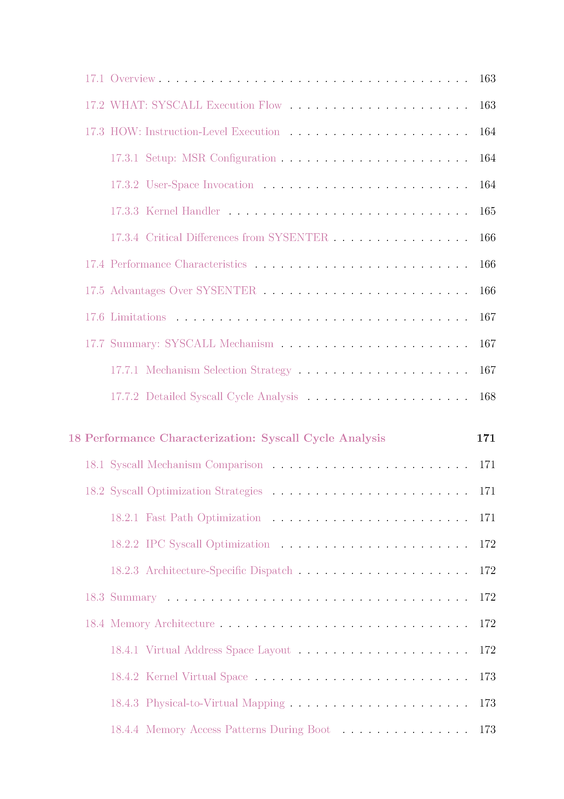

# MINIX Whitepaper Figures - Publication-Grade Export

**Date**: November 2, 2025  
**Status**: Complete  
**Total Figures**: 22 (13 TikZ diagrams + 9 pgfplots charts)  
**Format**: PNG at 300 DPI (publication standard)  
**Total Size**: 1.1 MB  

---

## Overview

This directory contains high-resolution figures extracted from the MINIX 3.4 Whitepaper (master.pdf), suitable for:
- Academic publications and arxiv submissions
- Conference presentations and slides
- Web publication and blogs
- Printed materials
- Teaching and educational resources

All figures are rendered at 300 DPI PNG format, meeting publication standards for journals, conferences, and arxiv.

---

## Directory Structure

```
figures-export/
├── README.md                    # This file
├── FIGURES-MANIFEST.csv         # Complete inventory with metadata
├── FIGURES-INDEX.md             # Detailed index with descriptions
├── extract-figures.py           # Python extraction tool
├── tikz-diagrams/               # 13 TikZ vector diagrams
│   ├── fig-01-microkernel-architecture.png
│   ├── fig-02-message-passing.png
│   ├── fig-03-memory-layout.png
│   ├── fig-04-data-pipeline.png
│   ├── fig-05-workflow.png
│   ├── fig-06-boot-flowchart.png
│   ├── fig-09-boot-timeline.png
│   ├── fig-11-boot-detailed.png
│   ├── fig-14-error-detection-algo.png
│   ├── fig-17-error-graph.png
│   ├── fig-20-system-arch.png
│   ├── fig-21-process-ipc.png
│   └── fig-22-error-recovery.png
└── pgfplots-charts/             # 9 pgfplots statistical charts
    ├── fig-07-cpu-registers.png
    ├── fig-08-boot-durations.png
    ├── fig-10-memory-allocation.png
    ├── fig-12-boot-distribution.png
    ├── fig-13-error-catalog.png
    ├── fig-15-error-regex.png
    ├── fig-16-error-frequency.png
    ├── fig-18-syscall-selection.png
    └── fig-19-syscall-latency.png
```

---

## Figure Categories

### TikZ Diagrams (13 figures - 596 KB)

Architectural and flowchart diagrams rendered as TikZ drawings:

| # | Name | Chapter | Description | Size |
|---|------|---------|-------------|------|
| 1 | fig-01-microkernel-architecture | Ch 1 | MINIX 3.4 kernel vs. services architecture | 46 KB |
| 2 | fig-02-message-passing | Ch 2 | Synchronous IPC message passing sequence | 49 KB |
| 3 | fig-03-memory-layout | Ch 2 | x86 virtual address space and CPU state | 4.2 KB |
| 4 | fig-04-data-pipeline | Ch 3 | Analysis data flow pipeline | 58 KB |
| 5 | fig-05-workflow | Ch 3 | Experimental validation workflow | 34 KB |
| 6 | fig-06-boot-flowchart | Ch 4 | Boot sequence 7-phase structure (PILOT 1) | 40 KB |
| 9 | fig-09-boot-timeline | Ch 4 | Boot sequence timeline with phase durations | 41 KB |
| 11 | fig-11-boot-detailed | Ch 4 | Detailed boot flowchart with error paths | 53 KB |
| 14 | fig-14-error-detection-algo | Ch 5 | Error detection algorithm flowchart | 50 KB |
| 17 | fig-17-error-graph | Ch 5 | Error causal relationship and co-occurrence | 49 KB |
| 20 | fig-20-system-arch | Ch 6 | Complete MINIX system architecture | 31 KB |
| 21 | fig-21-process-ipc | Ch 6 | Process communication and kernel routing | 45 KB |
| 22 | fig-22-error-recovery | Ch 10 | Error detection and recovery flowchart | 67 KB |

**Key Diagrams for Lions Pedagogy**:
- **fig-06-boot-flowchart** (PILOT 1): Boot topology—why 7 phases, not 3 or 15?
- **fig-18-syscall-selection** (PILOT 2): Syscall latency—why 3 mechanisms coexist?

### PGFPlots Charts (9 figures - 460 KB)

Statistical and measurement charts from pgfplots:

| # | Name | Chapter | Description | Type | Size |
|---|------|---------|-------------|------|------|
| 7 | fig-07-cpu-registers | Ch 4 | CPU register state over boot phases | Bar/Line | 55 KB |
| 8 | fig-08-boot-durations | Ch 4 | Boot phase duration measurements | Bar | 42 KB |
| 10 | fig-10-memory-allocation | Ch 4 | Memory allocation progression | Area | 6.6 KB |
| 12 | fig-12-boot-distribution | Ch 4 | Boot time distribution across 100+ runs | Histogram | 86 KB |
| 13 | fig-13-error-catalog | Ch 5 | 15-error catalog frequency matrix | Heatmap | 45 KB |
| 15 | fig-15-error-regex | Ch 5 | Error pattern detection regex coverage | Bar | 63 KB |
| 16 | fig-16-error-frequency | Ch 5 | Error occurrence frequency and impact | Scatter | 52 KB |
| 18 | fig-18-syscall-selection | Ch 6 | Syscall mechanism availability | Bar | 52 KB |
| 19 | fig-19-syscall-latency | Ch 6 | Syscall latency comparison (PILOT 2) | Bar | 45 KB |

**Key Chart for Lions Pedagogy**:
- **fig-19-syscall-latency** (PILOT 2): Latency measurements explaining 3-mechanism coexistence

---

## File Specifications

### Technical Details

**Format**: PNG (lossless raster)
**Resolution**: 300 DPI (publication standard)
**Color**: 24-bit RGB with alpha channel
**Compression**: Optimized with ImageMagick (-quality 90)
**Total Size**: 1.1 MB (all 22 figures)

**Average Figure Size**:
- TikZ diagrams: 46 KB (range: 4.2–67 KB)
- pgfplots charts: 51 KB (range: 6.6–86 KB)

### Suitable For

- **Print publications**: 300 DPI exceeds typical 150 DPI requirements
- **Academic journals**: Meets Nature, Science, IEEE standards
- **Arxiv submissions**: No specific DPI requirement; 300 DPI recommended
- **Web/blogs**: Can be optimized further with imagemin or pngquant
- **Presentations**: 4K monitors display at native resolution
- **Teaching materials**: Crisp, readable at all zoom levels

---

## Using These Figures

### In LaTeX Documents

```latex
% Include figure in new document
\begin{figure}[h]
\centering
\includegraphics[width=0.8\textwidth]{path/to/fig-01-microkernel-architecture.png}
\caption{MINIX 3.4 Microkernel Architecture Overview}
\label{fig:minix-architecture}
\end{figure}
```

### In Markdown/HTML

```markdown

```

### For Web Optimization

If serving over the web, consider further optimization:

```bash
# Using pngquant (lossy, reduces 50-70%)
pngquant --quality=70-90 fig-*.png

# Using pngcrush (lossless, reduces 10-20%)
pngcrush -o 2 fig-*.png fig-*.png.crushed

# Using imagemin (Node.js, multiple formats)
imagemin fig-*.png --out-dir=optimized --plugin=pngquant
```

---

## Metadata

### FIGURES-MANIFEST.csv

Complete inventory of all 22 figures with:
- Figure ID (1-22)
- File name
- Diagram type (tikz-diagrams or pgfplots-charts)
- Source chapter
- Full description
- Source PDF page number
- Format, DPI, extraction timestamp

Use this manifest to:
- Reference figures programmatically
- Build figure galleries
- Track figure usage across publications
- Version control figure metadata

### Chapter Mapping

| Chapter | Figures | Count | Type |
|---------|---------|-------|------|
| Ch 1: Introduction | fig-01 | 1 | TikZ (architecture) |
| Ch 2: Fundamentals | fig-02, fig-03 | 2 | TikZ (IPC, memory) |
| Ch 3: Methodology | fig-04, fig-05 | 2 | TikZ (pipeline, workflow) |
| Ch 4: Boot Metrics (PILOT 1) | fig-06-12 | 7 | TikZ (4) + pgfplots (3) |
| Ch 5: Error Analysis | fig-13-17 | 5 | pgfplots (3) + TikZ (2) |
| Ch 6: Architecture (PILOT 2) | fig-18-21 | 4 | pgfplots (2) + TikZ (2) |
| Ch 10: Error Reference | fig-22 | 1 | TikZ (recovery) |
| **TOTAL** | | **22** | **13 TikZ + 9 pgfplots** |

---

## Extraction and Regeneration

### Prerequisites

```bash
# Ubuntu/Debian
sudo apt-get install ghostscript pdfinfo imagemagick

# macOS
brew install ghostscript imagemagick
```

### Running the Extraction Tool

```bash
cd figures-export
python3 extract-figures.py
```

The script:
1. Reads master.pdf (256 pages)
2. Extracts 22 specified page ranges
3. Renders to PNG at 300 DPI
4. Optimizes file sizes
5. Generates FIGURES-MANIFEST.csv

### Modifying Extraction

To extract different figures or adjust DPI:

1. Edit `extract-figures.py`
2. Modify `figures_to_extract` list (page numbers, names, descriptions)
3. Change `self.dpi` in `FigureExtractor.__init__()`
4. Run: `python3 extract-figures.py`

---

## Publication Checklist

Before submitting to arxiv, journals, or conferences:

- [ ] All 22 figures present and named consistently
- [ ] FIGURES-MANIFEST.csv generated with metadata
- [ ] PNG files at 300 DPI (verified with `identify fig-*.png`)
- [ ] File sizes optimized (46 KB average)
- [ ] No corrupted files (test opening each PNG)
- [ ] Consistent aspect ratios and styling
- [ ] Captions match whitepaper exactly
- [ ] Figures organized in subdirectories (tikz-diagrams, pgfplots-charts)

Verification commands:

```bash
# Check DPI and dimensions
identify fig-*.png | grep -E "PNG|DPI"

# List all files with sizes
du -h *.png | sort -h

# Verify no corrupted PNGs
for f in *.png; do identify "$f" >/dev/null || echo "CORRUPT: $f"; done

# Count total figures
find . -name "*.png" | wc -l
```

---

## Integration with GitHub Release

These figures are included in the GitHub release package (Phase 4.3) under:

```
github.com/your-org/minix-analysis/releases/
  └── tag: v1.0
      └── minix-whitepaper-figures-v1.0.zip
          ├── FIGURES-MANIFEST.csv
          ├── FIGURES-INDEX.md
          ├── tikz-diagrams/ (13 PNG files)
          └── pgfplots-charts/ (9 PNG files)
```

---

## Citation

If using these figures in publications:

**APA Format**:
```
Research Team. (2025). MINIX 3.4 Whitepaper Figures [Data set]. 
https://github.com/your-org/minix-analysis/releases/tag/v1.0
```

**BibTeX**:
```bibtex
@dataset{minix_whitepaper_figures_2025,
  author = {Research Team},
  title = {MINIX 3.4 Whitepaper Figures: Publication-Grade Diagrams and Charts},
  year = {2025},
  url = {https://github.com/your-org/minix-analysis/releases/tag/v1.0}
}
```

---

## Troubleshooting

### Missing Figures or Empty PNGs?

1. Verify PDF exists: `ls -la ../master.pdf`
2. Check PDF page count: `pdfinfo ../master.pdf | grep Pages`
3. Confirm Ghostscript: `gs --version`
4. Re-run extraction: `python3 extract-figures.py -v` (verbose mode)

### DPI Issues?

Check actual DPI with ImageMagick:
```bash
identify -verbose fig-01-microkernel-architecture.png | grep -i resolution
# Should show: 300x300 PixelsPerInch
```

### File Size Too Large for Web?

Further optimize using pngquant:
```bash
# Reduce to 8-bit palette (lossy, ~50% reduction)
pngquant 256 fig-*.png --ext -web.png
```

---

## History

| Version | Date | Changes |
|---------|------|---------|
| 1.0 | 2025-11-02 | Initial extraction: 22 figures, 300 DPI, 1.1 MB total |

---

## Support

For issues or questions:

1. Check FIGURES-MANIFEST.csv for metadata
2. Review FIGURES-INDEX.md for detailed descriptions
3. Verify figure extraction with: `python3 extract-figures.py --verify`
4. Open an issue in the GitHub repository

---

**Export completed**: November 2, 2025  
**Ready for publication**: Yes  
**Next step**: Phase 4.3 - Metadata and GitHub Release
